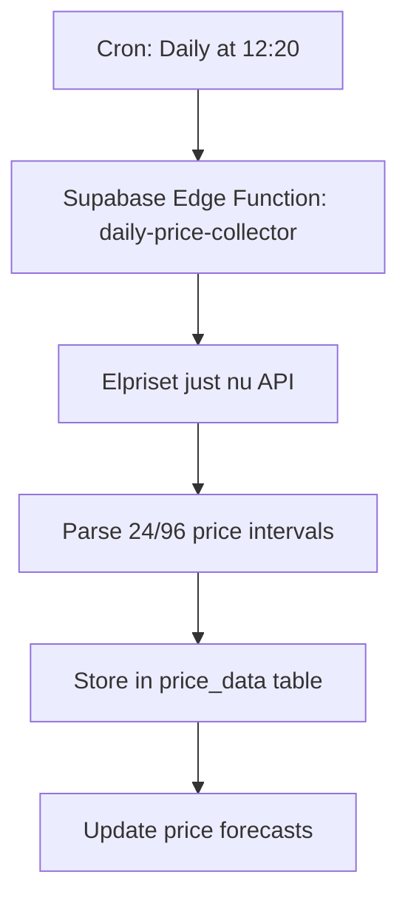
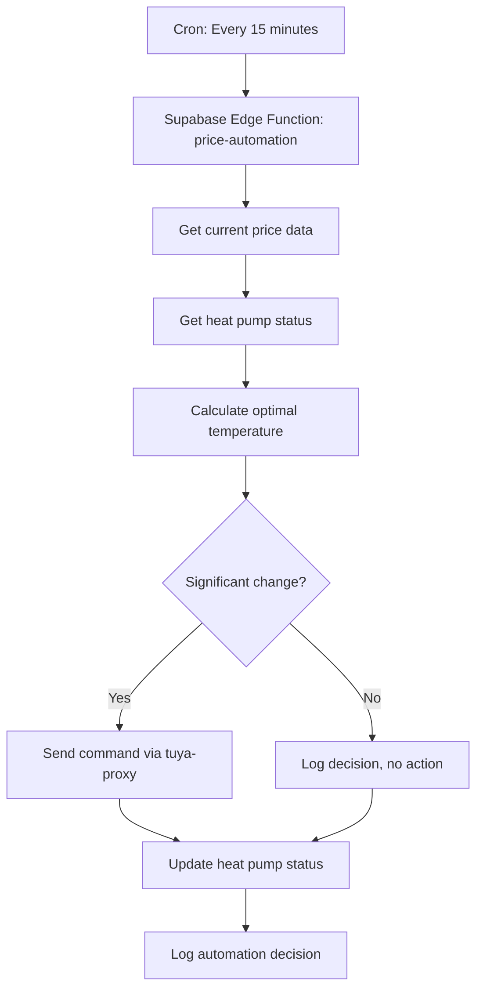
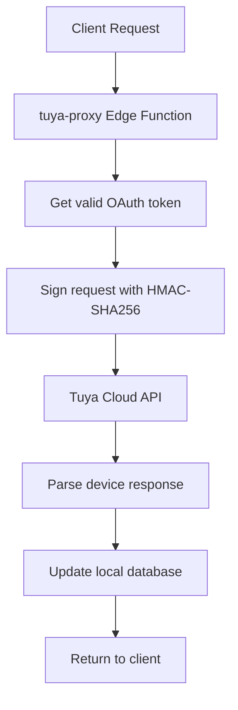
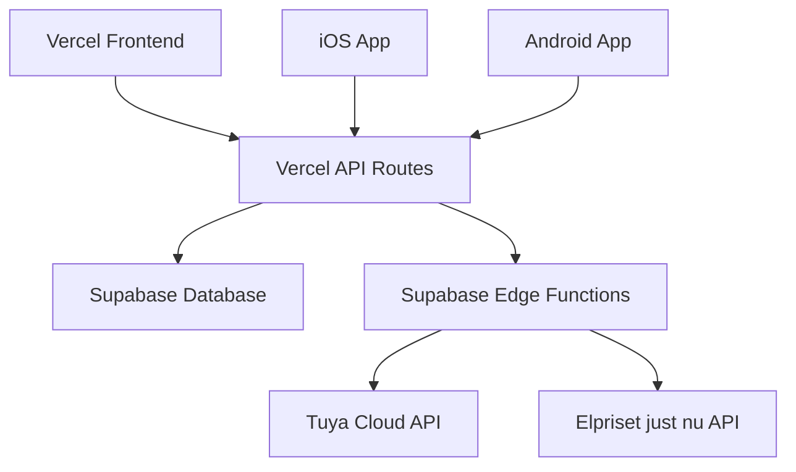

# Pool Heating System Architecture

## Project Overview

This is a smart pool heating system that automatically optimizes heat pump operation based on real-time electricity prices from the Swedish electricity market (Elpriset just nu). The system uses Tuya Cloud integration to control heat pump devices and Supabase for data storage and backend services.

## Technology Stack

- **Frontend**: Vite + React + TypeScript + Tailwind CSS + shadcn/ui
- **Backend**: Vercel Functions + Supabase (PostgreSQL + Edge Functions)
- **Device Integration**: Tuya Cloud API
- **Price Data**: Elpriset just nu API (Swedish electricity prices)
- **Deployment**: Vercel (frontend) + Supabase (backend)
- **Mobile**: Capacitor for iOS/Android (planned)

## Project Structure

```
poolheating/
├── api/                    # Vercel API routes
│   ├── automation.js      # Automation logic endpoint
│   ├── heatpump.js        # Heat pump control endpoint
│   └── prices.js          # Price data collection endpoint
├── src/
│   ├── components/        # React components
│   ├── services/          # Business logic services
│   ├── integrations/      # External service integrations
│   └── pages/            # Application pages
├── supabase/
│   ├── functions/        # Edge Functions (Deno)
│   ├── migrations/       # Database schema migrations
│   └── config.toml       # Supabase configuration
└── mobile/               # iOS client (to be created)
```

## Database Schema

### Core Tables

1. **price_data** - Electricity price data from Elpriset just nu
   - `bidding_zone` (SE1, SE2, SE3, SE4)
   - `start_time`, `end_time` - Price period
   - `price_value` - Price in SEK/kWh
   - `provider` - Data source (elpriset)

2. **heat_pump_status** - Current heat pump state
   - `device_id` - Tuya device identifier
   - `current_temp`, `target_temp`, `water_temp`
   - `power_status`, `mode`, `is_online`

3. **automation_settings** - User configuration
   - `target_pool_temp` - Desired pool temperature
   - `automation_enabled` - Enable/disable automation
   - `price_sensitivity` - How aggressively to respond to prices
   - `temp_tolerance` - Temperature adjustment limits

4. **automation_log** - Decision history
   - `current_price`, `avg_price_forecast`
   - `price_classification` (low/normal/high)
   - `action_reason` - Why decision was made

5. **tuya_config** - Tuya Cloud credentials
   - `client_id`, `client_secret`, `uid`, `device_id`
   - DP codes for device control

6. **tuya_tokens** - OAuth token management
   - `access_token`, `refresh_token`
   - `expires_at` - Token expiration

## Data Flow Architecture

### Daily Price Collection Flow



### 15-Minute Automation Flow



### Tuya Integration Flow



## API Endpoints

### Current API Routes

1. **GET/POST /api/automation** - Automation control and logs
2. **GET/POST /api/heatpump** - Heat pump status and commands
3. **GET/POST /api/prices** - Price data collection and retrieval

### Supabase Edge Functions

1. **daily-price-collector** - Fetches price data from Elpriset just nu
2. **price-automation** - Runs automation logic every 15 minutes
3. **tuya-proxy** - Proxies requests to Tuya Cloud API
4. **heat-pump-monitor** - Monitors device status

## Tuya Cloud Integration

### Authentication Flow

1. **Token Request**: Uses client credentials to get access token
   - Signature: `clientId + timestamp + stringToSign`
   - stringToSign: `GET\n\n\n/v1.0/token?grant_type=1`

2. **Business API Requests**: Uses access token for device operations
   - Signature: `clientId + access_token + timestamp + stringToSign`
   - stringToSign: `METHOD\nSHA256(body)\n\npathWithQuery`

### Device Control Points (DPs)

- **Power** (Boolean) - Device on/off
- **SetTemp** (Integer) - Target temperature in °C
- **SetMode** (String) - Operating mode (warm/cool/smart)
- **SilentMdoe** (Boolean) - Silent operation mode

## Price Classification Logic

The system classifies electricity prices into three categories:

1. **LOW** - Price < 30th percentile of historical data
2. **NORMAL** - Price between 30th and 70th percentile
3. **HIGH** - Price > 70th percentile of historical data

### Temperature Adjustment Strategy

- **LOW prices**: Heat aggressively (target + tolerance)
- **NORMAL prices**: Standard heating (target temperature)
- **HIGH prices**: Conservative heating (target - tolerance)

## Cron Jobs

### Vercel Cron (vercel.json)
- **Daily price collection**: `20 12 * * *` → `/api/prices`
- **Automation execution**: `*/15 * * * *` → `/api/automation`

### Supabase Cron (pg_cron)
- **Price automation**: `*/15 * * * *` → `price-automation` Edge Function

## Environment Variables

### Required Environment Variables

```bash
# Supabase
SUPABASE_URL=https://your-project.supabase.co
SUPABASE_SERVICE_ROLE_KEY=your-service-role-key

# Tuya Cloud
TUYA_CLIENT_ID=your-client-id
TUYA_CLIENT_SECRET=your-client-secret

# Application
PRICE_AREA=SE3
TIMEZONE=Europe/Stockholm
BASE_URL=https://your-app.vercel.app
```

## Security Considerations

1. **CORS**: Configured for mobile app access
2. **RLS**: Row Level Security enabled on all tables
3. **Service Role**: Used for backend operations only
4. **Token Management**: Automatic refresh and secure storage
5. **Input Validation**: All API inputs validated and sanitized

## Monitoring and Logging

1. **Automation Logs**: All decisions logged with reasoning
2. **Error Tracking**: Comprehensive error logging in Edge Functions
3. **Device Status**: Real-time device connectivity monitoring
4. **Price Data**: Historical price data for analysis

## Deployment Architecture



## Future Enhancements

1. **Mobile Apps**: Native iOS/Android applications
2. **Advanced Analytics**: Price prediction and optimization
3. **Multi-Device Support**: Multiple heat pumps
4. **Weather Integration**: Weather-based heating adjustments
5. **User Management**: Multi-user support with individual settings
